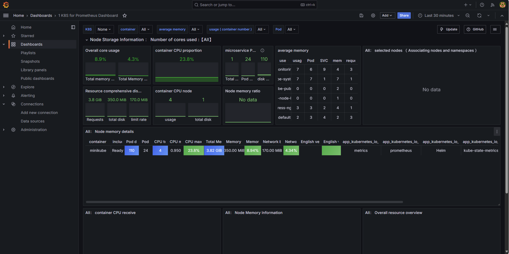

# Documentation

This repository contains both content and documentation of modern DevOps project following best practices of CI/CD and GitOps.

## Application Repository

+ [Fastzero API](https://github.com/mateussgubim/fastapi-project)

## Prerequisites

+ [Kubernetes](https://kubernetes.io/docs/setup/)
+ [Helm](https://helm.sh/docs/intro/install/#from-script)

## ArgoCD Installation

Check the [documentation](https://argo-cd.readthedocs.io/en/stable/getting_started/).

### Create namespace

```bash
kubectl create namespace argocd
```

### Install ArgoCD

```bash
kubectl apply -n argocd -f https://raw.githubusercontent.com/argoproj/argo-cd/stable/manifests/install.yaml
```

### Port-Forward

```bash
kubectl port-forward svc/argocd-server -n argocd 8080:443
```

### Access ArgoUI

Access [http://localhost:8080/](http://localhost:8080)

  + User: admin
  + Password:
    ```bash
    kubectl get secret argocd-initial-admin-secret -n argocd -o jsonpath="{.data.password}" | base64 -d
    ```

## Prometheus and Grafana Installation

```bash
kubectl create namespace monitoring
```

### Prometheus

Add repository

```bash
helm repo add prometheus-community https://prometheus-community.github.io/helm-charts
helm repo update
```

Install 

```bash
helm install prometheus prometheus-community/prometheus --namespace monitoring
```

Prometheus-server expose

```bash
kubectl expose service prometheus-server -n monitoring --type=NodePort --target-port=9090 --name=prometheus-server-ext
```

Application access

```bash
minikube service prometheus-server-ext -n monitoring
```

Port forward
```bash
kubectl port-forward svc/prometheus-server 9090:80 -n monitoring
```

### Grafana
```bash
helm repo add grafana https://grafana.github.io/helm-charts
helm repo update
```

Install 

```bash
helm install grafana grafana/grafana --namespace monitoring
```

Prometheus-server expose

```bash
kubectl expose service grafana -n monitoring --type=NodePort --target-port=3000 --name=grafana-ext
```

Application access

```bash
minikube service grafana-ext -n monitoring
```

Port forward

```bash
kubectl port-forward svc/grafana 3030:80 -n monitoring
```

Credentials

User: admin

Password: 
```bash
kubectl get secret --namespace monitoring grafana -o jsonpath="{.data.admin-password}" | base64 --decode ; echo
```

### Grafana Connection

Go to `Connection` and `Data sources`.

Select `Add data source` and select `prometheus`.

At `Connection` include the internal cluster URL of Prometheus Application by referring the URL displayed by `minikube service prometheus-server-ext` command.

Click on `save & test`.

### Grafana Dashboard
Go to `Dashboard` folder, select `+ Create dashboard` and click on `Import dashboard`.

You can get the used dashboard [here](https://grafana.com/grafana/dashboards/15661-1-k8s-for-prometheus-dashboard-20211010/)

At dashboard page click on `Copy ID to clipboard`. Get back to grafana, paste it and click on `load`.

After that, you can rename your dashboard. Select prometheus and click on `import`.

